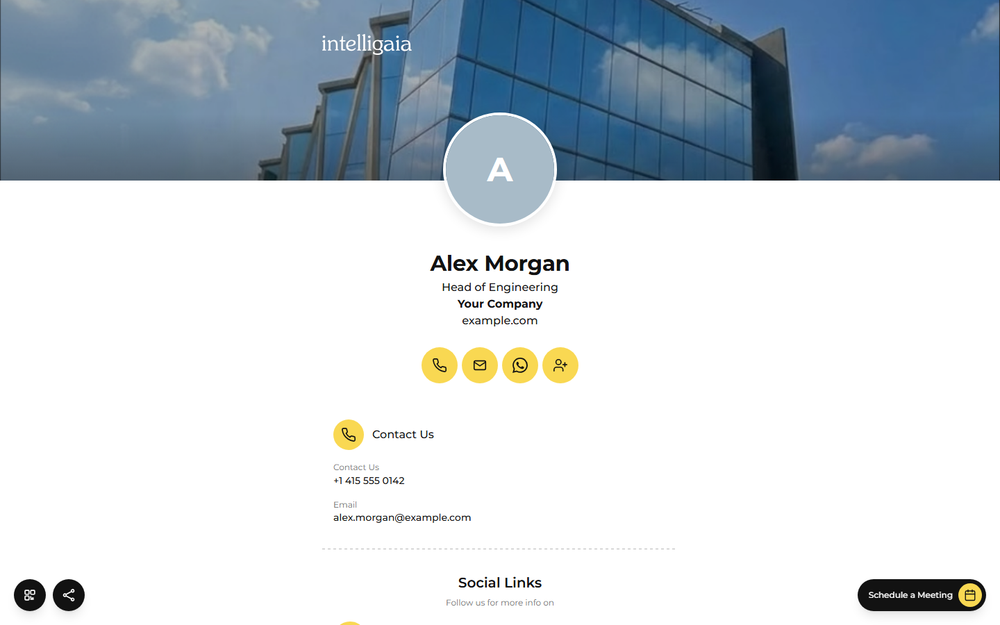
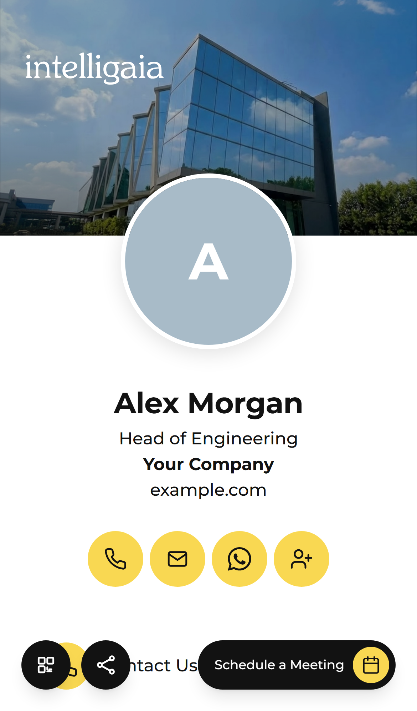
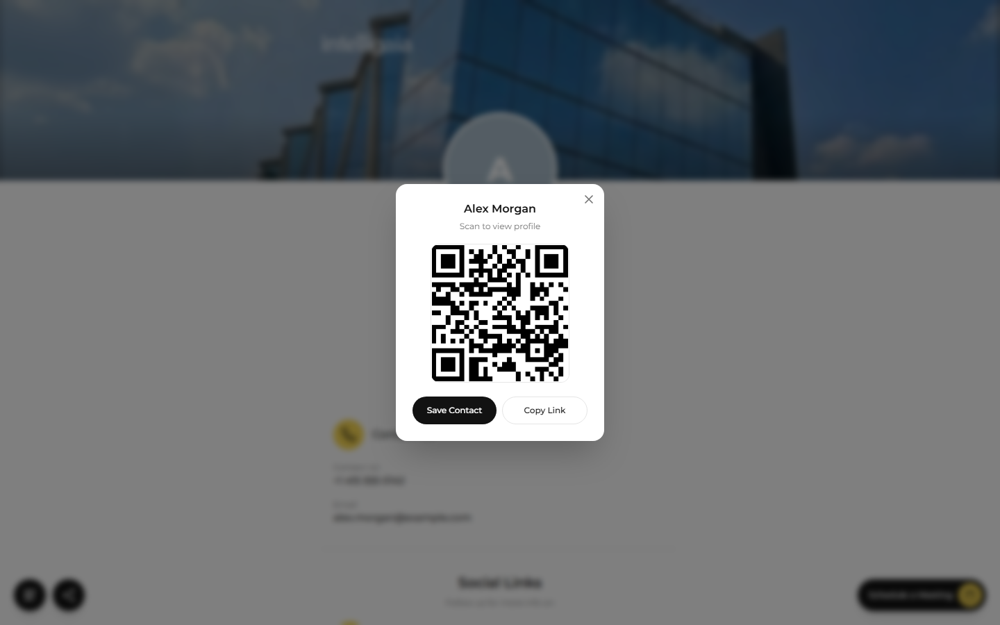
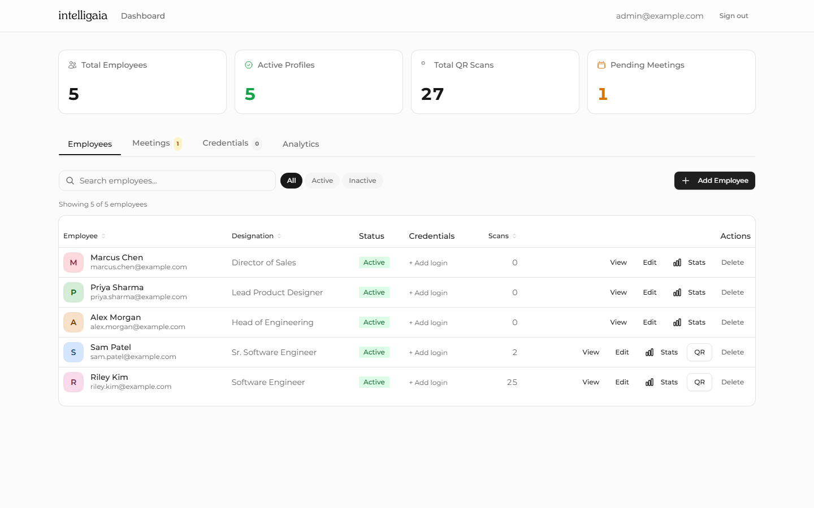
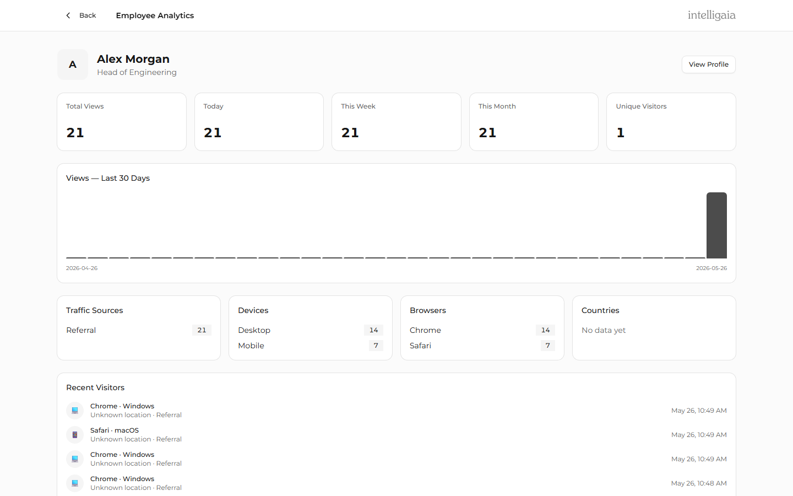
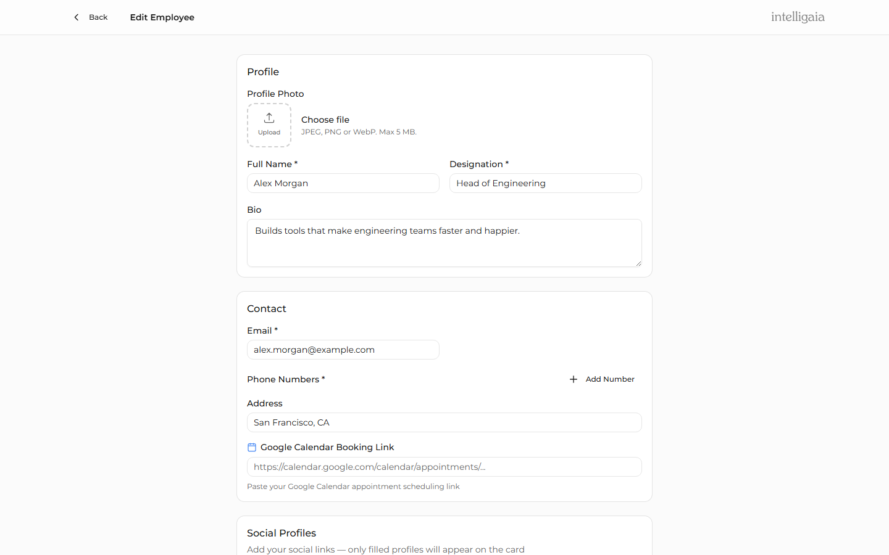

# Employee Profile Platform

A digital business-card and employee-profile platform: each employee gets a public profile page reachable via shareable link and QR code, with vCard download, quick-action buttons (call, email, calendar booking, WhatsApp), and per-employee visitor analytics.

> **Source-available, not OSI open source.** This project is published under the **Intelligaia Source Available License (ISAL) v1.0**. See [LICENSE](./LICENSE) for terms. Commercial / SaaS usage requires a separate license from Intelligaia — see [COMMERCIAL_USE.md](./COMMERCIAL_USE.md).

---

## Screenshots

| Public profile (desktop) | Public profile (mobile) | QR share |
|---|---|---|
|  |  |  |

| Admin dashboard | Per-employee analytics | Employee editor |
|---|---|---|
|  |  |  |

> Screenshots use a fictional demo dataset created by [`scripts/seed-demo.ts`](./scripts/seed-demo.ts). To regenerate them after UI changes: run `npm run dev`, then `npx tsx scripts/seed-demo.ts` and `npx tsx scripts/capture-screenshots.ts`.

---

## Features

- Public profile pages at `/p/<slug>` with hero, social links, contact card, and "save to contacts" via vCard
- QR code generation per employee (S3-hosted or local fallback)
- Admin dashboard: create/edit/delete employees, view analytics, manage credentials
- Self-service employee portal: employees log in and edit their own profile
- Visitor analytics: aggregate dashboard + per-employee drill-down with source tracking
- Quick actions: configurable call / email / Google Calendar / WhatsApp / Telegram buttons
- S3-backed media uploads with presigned URLs (falls back to local `uploads/` folder when not configured)

## Tech stack

| Layer | Stack |
|---|---|
| Frontend | Next.js 15 (App Router), React 19, Tailwind CSS, shadcn/ui, Radix UI |
| Backend | Express, TypeScript, Zod validation |
| Database | PostgreSQL via Prisma ORM |
| Auth | JWT (httpOnly cookies), bcrypt hashing |
| Storage | AWS S3 (multer-s3) with local fallback |
| Tests | Playwright (e2e) |
| Monorepo | npm workspaces |

## Repository layout

```
.
├── apps/
│   ├── api/                 Express API service (port 4000)
│   └── web/                 Next.js app (port 3000)
├── packages/
│   ├── db/                  Prisma schema, client, seed script
│   └── shared/              Shared types and Zod schemas
├── .github/                 Issue templates, PR template, CI workflows
├── LICENSE                  Intelligaia Source Available License (ISAL) v1.0
├── TRADEMARK.md             Brand and trademark policy
├── COMMERCIAL_USE.md        Enterprise licensing guide
├── CONTRIBUTING.md
├── CODE_OF_CONDUCT.md
└── SECURITY.md
```

## Prerequisites

- Node.js 20 or newer
- PostgreSQL 14 or newer (local or Docker)
- npm 10+ (this repo uses npm workspaces)
- (Optional) AWS S3 bucket + IAM user for production-grade media storage

## Quickstart

```bash
# 1. Clone
git clone https://github.com/intelligaia-open-labs/employee-profile-platform.git
cd employee-profile-platform

# 2. Install dependencies (uses npm workspaces)
npm install

# 3. Copy env templates
cp apps/api/.env.example apps/api/.env
cp apps/web/.env.local.example apps/web/.env.local
cp packages/db/.env.example packages/db/.env

# 4. Fill in DATABASE_URL and JWT_SECRET in apps/api/.env and packages/db/.env
#    Generate a JWT secret:
#    node -e "console.log(require('crypto').randomBytes(48).toString('hex'))"

# 5. Set up the database schema
npm run db:push

# 6. Seed the default admin account (see warning below before production!)
npm run db:seed

# 7. Start API + web together
npm run dev
```

The web app will be at <http://localhost:3000>, the API at <http://localhost:4000>.

> ⚠️ **Change the default admin credentials immediately.** With no env overrides, the seed creates `admin@example.com` / `changeme-local-only` for local dev only. The seed refuses to run with defaults when `NODE_ENV=production`. To seed a real admin, set `SEED_ADMIN_EMAIL` and `SEED_ADMIN_PASSWORD` in `packages/db/.env` before running `npm run db:seed`.

## Environment variables

### `apps/api/.env`

| Variable | Required | Default | Description |
|---|---|---|---|
| `DATABASE_URL` | yes | — | Postgres connection string |
| `JWT_SECRET` | yes | — | Min 32 chars. Generate with `crypto.randomBytes(48)` |
| `PORT` | no | `4000` | API listen port |
| `CORS_ORIGIN` | no | `http://localhost:3000` | Comma-separated allowed origins |
| `BASE_URL` | no | `http://localhost:4000` | Public-facing API URL |
| `PUBLIC_URL` | no | `http://localhost:3000` | Public-facing web URL (used in QR codes) |
| `NODE_ENV` | no | `development` | `development` / `production` / `test` |
| `COMPANY_NAME` | no | `Your Company` | Used in the vCard `ORG:` field. Keep in sync with `NEXT_PUBLIC_BRAND_NAME` |
| `AWS_ACCESS_KEY_ID` | no | — | If set with secret + bucket, enables S3 uploads |
| `AWS_SECRET_ACCESS_KEY` | no | — | Pair with access key |
| `AWS_REGION` | no | `us-east-1` | S3 region |
| `AWS_S3_BUCKET` | no | — | S3 bucket name |

### `apps/web/.env.local`

| Variable | Required | Default | Description |
|---|---|---|---|
| `NEXT_PUBLIC_API_URL` | no | `http://localhost:4000` | Base URL of the API service |
| `NEXT_PUBLIC_BRAND_NAME` | no | `Your Company` | Full company name shown on profile contact card |
| `NEXT_PUBLIC_BRAND_SHORT_NAME` | no | `Logo` | Short brand label used for logo alt text |
| `NEXT_PUBLIC_BRAND_WEBSITE` | no | `example.com` | Domain shown on profile contact card |
| `NEXT_PUBLIC_BRAND_TAGLINE` | no | `""` | Optional tagline under the logo. Hidden when blank |
| `NEXT_PUBLIC_BRAND_SUBTITLE` | no | `""` | Optional subtitle under company name on contact card |
| `NEXT_PUBLIC_BRAND_ADDRESS` | no | `""` | Multi-line address. Use `\n` between lines. Address block is hidden when blank |
| `NEXT_PUBLIC_BRAND_MAP_URL` | no | `""` | Maps URL for the "Get directions" button. Button hidden when blank |
| `NEXT_PUBLIC_BRAND_LOGO_LIGHT` | no | `/profile/logo.svg` | Path or URL to the light-background logo |
| `NEXT_PUBLIC_BRAND_LOGO_DARK` | no | `/profile/logo-dark.svg` | Path or URL to the dark-background logo |

> **Replacing the logo:** drop your own SVG/PNG into `apps/web/public/profile/` and point the `NEXT_PUBLIC_BRAND_LOGO_*` vars at it, or keep the default filenames and overwrite the files in place. The defaults are sized for a 24–30px display height.

### `packages/db/.env`

| Variable | Required | Description |
|---|---|---|
| `DATABASE_URL` | yes | Must match `apps/api/.env`. Used by Prisma CLI for migrations and seeding |
| `SEED_ADMIN_EMAIL` | no | Email for the seeded admin account. Defaults to `admin@example.com` |
| `SEED_ADMIN_PASSWORD` | no | Password for the seeded admin account. Defaults to `changeme-local-only`. Seed refuses to run with defaults when `NODE_ENV=production` |

## Scripts

| Script | What it does |
|---|---|
| `npm run dev` | Run API and web concurrently |
| `npm run dev:api` | Run API only |
| `npm run dev:web` | Run web only |
| `npm run build` | Build shared → db → api → web in order |
| `npm run db:generate` | Generate Prisma client |
| `npm run db:push` | Push schema to database (dev) |
| `npm run db:seed` | Seed default admin |

## Production deployment notes

- Set `NODE_ENV=production`
- Use a real JWT secret (never reuse the local-dev one)
- Configure S3 with an IAM user limited to `PutObject` / `GetObject` on the bucket — never an account-wide key
- Run database migrations via `prisma migrate deploy` (do NOT use `db:push` in production)
- Front the API behind a reverse proxy with HTTPS
- Rotate `JWT_SECRET` triggers re-login for all users

## Contributing

See [CONTRIBUTING.md](./CONTRIBUTING.md). All contributors must accept the contributor terms outlined there before a PR can be merged.

## Security

If you discover a security vulnerability, **do not open a public issue**. See [SECURITY.md](./SECURITY.md) for the private disclosure process.

## License

This project is licensed under the **Intelligaia Source Available License (ISAL) v1.0**. See [LICENSE](./LICENSE) for the full terms.

In short:

- ✅ View, fork, modify, and self-host for **personal, educational, research, evaluation, or internal business** purposes
- ✅ Use it as your own organization's internal employee directory
- ✅ Contribute back to the public repo
- ❌ Do **not** offer it as a hosted / managed commercial service
- ❌ Do **not** white-label, rebrand, or bundle it into a paid product
- ❌ Do **not** use the source, prompts, designs, or assets to train AI / ML models without prior approval
- ⚠️ Public usage must keep the **"Powered by Intelligaia"** attribution with a link to <https://www.intelligaia.com/>

See [COMMERCIAL_USE.md](./COMMERCIAL_USE.md) for enterprise licensing and [TRADEMARK.md](./TRADEMARK.md) for brand-use rules.

### Commercial licensing

For commercial use, hosted-service deployments, or licensing inquiries, contact: **licensing@intelligaia.com**

---

Built and maintained by [Intelligaia](https://www.intelligaia.com/).


